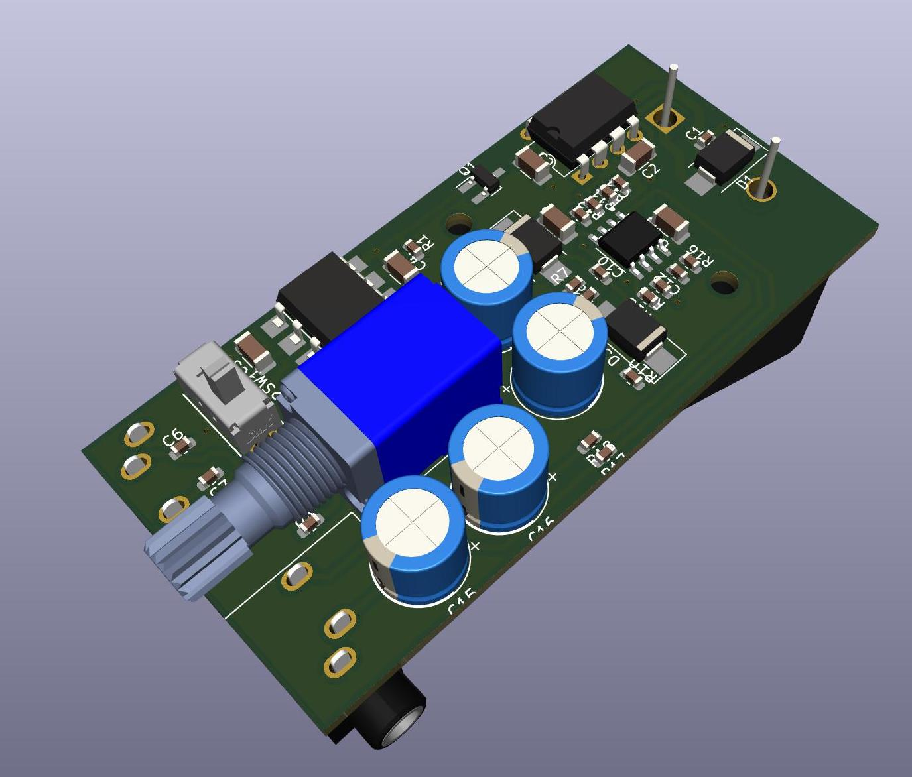

This repository contains KiCAD design files for a stereo microphone pre-amplifier targeting the Church Audio CA-11. 

The pre-amp delivers a 5V bias voltage to the microphone, and features padding and a fixed gain.

